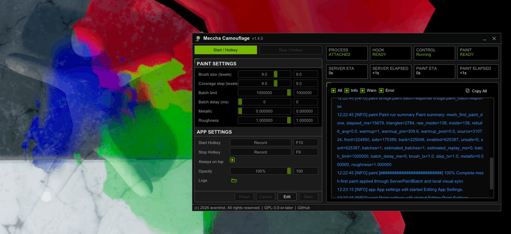

<p align="center">
  
</p>

<h1>
  
  Meccha Camouflage (Apple Silicon / Wine Optimized)
</h1>

An optimized, native Win32/D3D11 C++ frontend fork of the Meccha Camouflage tool, specifically refactored to run smoothly on Apple Silicon (M1/M2/M3) Macs under Wine/CrossOver without isolated rendering subprocess crashes.

---

## 🚀 Why this Fork?
In official version `v1.5.0` of Meccha Camouflage, the frontend control panel was migrated to a WPF + WebView2 (Chromium) wrapper. Due to isolated rendering sandbox constraints under Wine/CrossOver on macOS, this resulted in a persistent **black screen** or crash of the control application.

This fork restores the high-performance **Dear ImGui / Direct3D 11** native overlay architecture from `v1.4.0` while fully preserving all core algorithm updates, timing delays, and batch settings from `v1.5.0`.

- **Platform Target**: Optimized for M-series Apple Silicon Mac (tested on M2 Pro under CrossOver 26.2).
- **GPU Compatibility**: Pure D3D11 native graphics, bypassing Chromium sandbox limitations under Wine/CrossOver.
- **Stand-alone Execution**: Compiled into a single, clean Win32 binary with embedded assets.

---

## 📦 Downloads
Get the latest compiled binary from GitHub Releases:
👉 **[Download Latest Native Release](https://github.com/Caspermun/MecchaCamouflage/releases/latest)**

---

## 🛠 Installation & Setup in CrossOver

Follow these steps to run Meccha Camouflage on your Mac:

### 1. Create or Open a Steam Bottle
Open **CrossOver** and select your existing bottle where *MECCHA CHAMELEON* is installed (or create a new Windows 10/11 bottle).

### 2. Copy the Executable
Copy the downloaded `meccha-camouflage.exe` into your bottle's virtual C: drive (or leave it in your macOS Downloads folder, which is accessible via the bottle's file browser).

### 3. Add App Shortcut in CrossOver
1. In the right-hand panel of CrossOver, click **"Run Command..."** (*Запуск команды*).
2. Click **"Browse..."** (*Обзор*) and select your `meccha-camouflage.exe`.
3. Click **"Save as Link to Programs"** (*Создать ярлык в программах*). This adds the launcher icon to your bottle home screen.

### 4. Running the Tool
1. First, launch **MECCHA CHAMELEON** through Steam inside CrossOver.
2. Next, launch **Meccha Camouflage** using the shortcut you created.
3. The native C++ overlay will automatically find the game process, attach, and configure settings.
4. Press the designated hotkey (default: `F1` to start, `F2` to preview) to trigger the paint mechanism.

---

## ⚙️ Configuration File
All configurations are saved locally in the standard Windows app data directory inside your Wine prefix:
```text
C:\Users\crossover\AppData\Local\MecchaCamouflage\versions\<version>\config.json
```

---

## 🏗 Development & Compiling

If you want to build the native executable yourself on a Windows machine or via MSBuild:

```bash
# Clone the repository
git clone https://github.com/Caspermun/MecchaCamouflage.git
cd MecchaCamouflage

# Build using the build script
powershell -File .\scripts\build.ps1 -Version "v1.5.0-native"
```

The automated GitHub Actions workflow will also compile it and post the artifact under the **Actions** tab on every push.

---

## 📜 License & Branding
This project is licensed under the GPL-3.0 License. This is an unofficial, community-optimized build. All rights to the original application concepts belong to the upstream developers at [acentrist/MecchaCamouflage](https://github.com/acentrist/MecchaCamouflage).
